The [Fibonacci Numbers](https://en.wikipedia.org/wiki/Fibonacci_number) are a sequence starting, `0, 1, 1,...`, and each subsequent number being computed as the sum of the previous two.

We could define this in pseudocode:

```ts
getNthFibonacciNumber(n) {
  if (n is 0 or 1) return 1;
  return getNthFibonacciNumber(n - 1)
    + getNthFibonacciNumber(n - 2);
}
```

When inspecting the sequence of numbers this outputs _and in particular_ the digits of these numbers, we can observe some repeating cycles. Additionally we can prove that for any finite number digits, _they must repeat after some finite number of steps_. This works regardless of what base number system we use (although the exact length of the cycles will be altered).

## Informal proof of digit cycles

I would try to 'formally' prove this, but it's been so long since I've had to formally prove anything that my tools for doing so are rusty. Consider the following a sketch of what a formal proof might look like:

Considering just the `k` least-siginificant digits of the Fibonacci sequence, we can model the 'state' of the sequence at any point as the pair of `k` digits corresponding to the previous value and the current value.

Define a directed graph having nodes corresponding to such pairs. Let each node have exactly one outbound edge pointing to the state that comes next in the Fibonacci sequence. For example the 'state' with previous value `2` and current value `3` will have a single outbound edge to the next state which has previous value `3` and current value `5`.

By repeatedly following outbound edges, we can trace a path through the graph. At each node there is exactly one following node. This excludes the possibility of dead ends (which could only happen if there were 0 outbound edges on a given node) or of branching points (which could only happen if there were strictly more than 1 outbound edges on a given node). Additionally we know that the total number of nodes is finite. Given these statements in combination, it must be that we eventually revisit nodes we have seen before.

We can also assert that every node has exactly one inbound node. This is trickier to prove, but can be demonstrated by observing that the mapping from one node to the next is bijective. It can also be seen by rearranging the definition of Fibonacci numbers to work "backwards", i.e. given two adjacent values in the Fibonacci sequence, you can deduce the value immediately prior to that pair. This is left as an exercise to the reader.

So we now have:

- There are finitely many nodes
- Every node has exactly one outbound edge
- Every node has exactly one inbound edge

This is sufficient to conclude that every path traced from any node forms a [cycle](https://en.wikipedia.org/wiki/Cycle_%28graph_theory%29)

Indeed every node and every edge is a member of exactly one cycle.

Therefore the resulting graph is a disjoint union of cycles.

**QED** _maybe?_

## One digit in decimal

Let's see what the graph looks like considering just the least significant digit as represented in decimal. There are 100 nodes, since there are 10 possible values for a single value, but each state is a pair of such values.

The canonical starting state `1, 1` is drawn in a circle rather than a box. You can see it is a member of the longest cycle in this graph, which is 60 edges long.


## One Digit in binary

Given just the least significant bit of Fibonacci numbers as written in binary.


## Two Digits in binary

This is the first example we have seen in which the 'canonical' cycle is not strictly the longest.


## Three Digits in binary


