The [Fibonacci Numbers](https://en.wikipedia.org/wiki/Fibonacci_number) are a sequence starting, `0, 1, 1,...`, and each subsequent number being computed as the sum of the previous two.

We could define this in pseudocode:

```ts
getNthFibonacci(n) {
  if (n is 0 or 1) return 1;
  return getNthFibonacci(n - 1)
    + getNthFibonacci(n - 2);
}
```

When inspecting the sequence of numbers this outputs _and in particular_ the digits of these numbers, we can observe some repeating cycles. However the choice of base number system affects the digits we will see. In order to generalize this independent of base number system, we can inspect the sequence under some modulo. The digits we see in base ten correspond to the sequence under a modulo of power ten.

We can prove that under any modulo, _the values must repeat after some finite number of steps_.

## Cycles under modulo arithmetic

I would try to 'formally' prove this, but it's been so long since I've had to formally prove anything that my tools for doing so are rusty. Consider the following a sketch of what a formal proof might look like:

Considering the Fibonacci sequence under modulo `k`, we can model the 'state' of the sequence at any point as a pair of values corresponding to the previous value and the current value.

Define a directed graph having nodes corresponding to such pairs. Let each node have exactly one outbound edge pointing to the state that comes next in the Fibonacci sequence under the modulo `k`. For example the 'state' with previous value `2` and current value `3` under modulo `10` will have a single outbound edge to the next state which has previous value `3` and current value `5`.

By repeatedly following outbound edges, we can trace a path through the graph. At each node there is exactly one following node. This excludes the possibility of dead ends (which could only happen if there were 0 outbound edges on a given node) or of branching points (which could only happen if there were strictly more than 1 outbound edges on a given node). Additionally we know that the total number of nodes is finite. Given these statements in combination, it must be that we eventually revisit nodes we have seen before.

We can also assert that every node has exactly one inbound node. This is trickier to prove, but can be demonstrated by observing that the mapping from one node to the next is bijective. It can also be seen by rearranging the definition of Fibonacci numbers to work "backwards", i.e. given two adjacent values in the Fibonacci sequence, you can deduce the value immediately prior to that pair. This is left as an exercise to the reader.

So we now have:

- There are finitely many nodes.
- Every node has exactly one outbound edge.
- Every node has exactly one inbound edge.

This is sufficient to conclude that every path traced from any node forms a [cycle](https://en.wikipedia.org/wiki/Cycle_%28graph_theory%29).

Indeed every node and every edge is a member of exactly one cycle.

Therefore the resulting graph is a disjoint union of cycles.

**QED** _maybe?_

## Examples

For each of the following diagrams the canonical starting state `1, 1` is circled.

### Modulo 2

This is equivalent to inspecting the least siginificant digit, when using base 2.

<details>
  <summary><strong>[Click to expand]</strong> Fibonacci numbers under mod 2</summary>
  
</details>

### Modulo 3

<details>
  <summary><strong>[Click to expand]</strong> Fibonacci numbers under mod 3</summary>
  
</details>

### Modulo 4

This is the first one for which the canonical cycle is not strictly the longest.

<details>
  <summary><strong>[Click to expand]</strong> Fibonacci numbers under mod 4</summary>
  
</details>

### Modulo 5

<details>
  <summary><strong>[Click to expand]</strong> Fibonacci numbers under mod 5</summary>
  
</details>

### Modulo 6

<details>
  <summary><strong>[Click to expand]</strong> Fibonacci numbers under mod 6</summary>
  
</details>

### Modulo 7

<details>
  <summary><strong>[Click to expand]</strong> Fibonacci numbers under mod 7</summary>
  
</details>

### Modulo 8

<details>
  <summary><strong>[Click to expand]</strong> Fibonacci numbers under mod 8</summary>
  
</details>

### Modulo 9

<details>
  <summary><strong>[Click to expand]</strong> Fibonacci numbers under mod 9</summary>
  
</details>

### Modulo 10

<details>
  <summary><strong>[Click to expand]</strong> Fibonacci numbers under mod 10</summary>
  
</details>

## Other Sequences

One might wonder whether other numeric sequences could be made to produce graphs in a similar way. It's not immediately clear to me what the set of all sequences we can do this to looks like. But perhaps we can consider some examples.

For an example which _could not_ be graphed in this way, consider the sequence of prime numbers. Under some modulo `k`, we can't _in general_ know which digits will come next. We require the whole value of the current prime number to be able to determine the next prime. We might instead alter the process slightly to have the output of a given node split multiple ways corresponding to the set of all _possible_ subsequent digits. An especially simple case of this would be considering prime numbers under modulo 2.


After the prime `2` every later primary is an odd number, hence we continues to be stuck on the `1` forever more.

However I do not know of a systematic way to produce the diagram for any modulo higher than 2. We might expect the modulo 3 to be the next easiest, but I'm at a loss to reason about the set of all possible adjacencies. Instead I'm left resorting to manually iterating through prime numbers until such a time as I consistently fail to find new edges. However I am unable to exclude the possibility of edges turning up later.

I can automate this somewhat using the following code:

<details>
  <summary><strong>[Click to expand]</strong> Code for generating prime mod edges</summary>

```ts
/**
 * @returns an array of all primes from 2 up to
 * and including `bound`
 */
const generatePrimesUpTo = (bound: number) => {
  // Sieve of Eratosthenes

  // An array of integers from 2 to bound inclusive
  const primeCandidates = new Array(bound - 1)
    .fill(null)
    .map((_, i) => ({ value: i + 2, isPrime: true }));

  // Little hack to 'pretend' our indexes start at 2
  const get = (n: number) => primeCandidates[n - 2];

  // Any divisor larger than this is irrelevant
  const largestDivisor = Math.sqrt(bound);

  for (let divisor = 2; divisor <= largestDivisor; divisor++) {
    // We don't care about non-prime divisors
    if (!get(divisor).isPrime) continue;

    // Mark all multiples of this divisor as not prime
    for (let multiple = divisor ** 2; multiple <= bound; multiple += divisor) {
      get(multiple).isPrime = false;
    }
  }

  return primeCandidates
    .filter(({ isPrime }) => isPrime)
    .map(({ value }) => value);
};

/**
 * Modulo helper, curried to make a neat pipeline
 */
const mod = (modulo: number) => (value: number) => value % modulo;

/**
 * Given an array of values,
 * return the set of edges defined by adjacent values
 *
 * Edges are formatted as a string
 * compatible with Mermaid syntax
 */
const extractEdges = (values: Array<number>) => {
  const edges = new Set<`${number}-->${number};`>();

  for (let i = 1; i < values.length; i++) {
    edges.add(`${values[i - 1]}-->${values[i]};`);
  }

  return edges;
};

const primes = generatePrimesUpTo(1000000);
// console.log(primes);

const moddedPrimes = primes.map(mod(3));
// console.log(moddedPrimes);

const edges = extractEdges(moddedPrimes);
// console.log(edges);

const allTogether = [...edges].join("\n");
console.log(allTogether);
```

</details>

[TypeScript playground for generating primary number modulo edges](https://www.typescriptlang.org/play?#code/PQKhCgAIUgBAnApgFwK7wHYGdIEMN7zy4CekA9gGZ4A2NkADvAJYC2iOl85rkATJFQNIycngwATSMwwBjGqgkyA5pAAGAI3KpJaqCGDhZ5bMkjLEGRMWSIACi3ZYAqgwAqYgLyQAFFp0SAFyQGKisGtYAlJCeAHyQAN5QkMDAkADKzIgAbogU1ACiNuRYyAAWlhzgyamQDuQSqLJ5+ITEZFTSGLYW8JzcvAKikP6SXfKoWMy5ycamjI6IAML4ShK4tjjeVgDukACCRKR+2mMAtJAAjJEAdJTMdD6hdLesuAw+PgD6ADTS0XFfAlINlcApEMFmJAANT8P7MLAONgQkTwVCIAC+kUiAG5qpAUmkADLMZDIGh5Mq4WQAaxEYgA5EwUJYJAyKOguhJEAAPDiQUq4eBmDb8WYmUrmFArSTMda2GK+DDBULhKIxeJMZEytYbDgAbQIFz4AF08TU0vsMGQlNkEeR4JAaELeiIqQRygjIDsHvRKLgHvTILyJtzxGQMCYzlqnOL5s74BZSgAlRAU0HdAAi03tju8AFkNmUblgAI7Ck4BXH4yCUB2+ClmW25xV8HGQZtYesAHm8CaTyFT6fwyGzdq78HbnYd0Oh0SSBIJtQA6nkJCYGWZZEKWv4zJGMNHFh2cxOsMkCcxqD4AIQWZA6uV6nzT+C3BFI9jRObIGTo82LoSkCFvAdJgvQrCoDQv4MBSOCdJ6OCvngOCRmYMaIBetb1j4jaQJB0HMLBeTeMhYD8O2BEwRSkC9iMpwSJRUHUXk0KkaeDrzlhBL3o+8qID4VFERS76Ise3j+jQWCIHigEYsk8nJEgaCYAs2qrE+mxYXcDy2PAnzAh+x5Yhq0hicikTaW8Hw+MCoLgpAJmAvZ6LVhi5qgBA0DAQ0UFiBUNAMNYfyyOgLCIFIwxvDSeQMLgWBTBgqgyMMaiHO0NxMOQojICQQU3NZajBvFJD6IYcySqwDSKoJvk0OQKphBEb6mT4LkoqqzUAvE7WQAApPhdXkB5YD6JAADi0yWOIbSkPkIJguiWB-Mp6AehUAooPNEVJh2iD3FYUgaGQuASAAVtSlhmO157eWNBQSLtO7YfAbxkhFKF4AKyAsElkDGKwcW-hoNE+uUwHWG8coCiQ3S4DyZVGBKZi8j91LIA9u3eG1i0cME6WkN2nXWLE3WJHGko7fy2yIHs6QoN2agACQJMT8AYmcZyxCzbPuWosQ+NWyR1o6uFbVC3iXO2ULdgt4JYDcFJJeU0uzlxgFUwrp0SD4zMJDd+pQhclwmhzXMswbzCmziajVgSikEqtqma3iikVehixbFKVg2PYnuuB4PiXAADKHofVrUFXkBSivkMoPgYVgQvu4NEjchIn7U2pTgFe8tU6wAzNieKRxK0eILH8dVWnEWZ0n5op5riqo8QsgY49HD5+ndcR2kUcx-V8ea8nyO0DQHj3hUeaQPqNxz5rJo3Gd5AyD4DIADoYAy1b9xXg8+OBE8oFP1ZAA)

We can use this to generate diagrams... however I can't emphasise enough that I cannot prove these diagrams are complete.

### Primes under modulo 3

I think this one _in particular_ can be proven to be complete. The node `0 mod 3` is only visited once, by the prime `3`. It is immediately preceded by `2` and followed by `5` which is congruent to `2 mod 3`. Hence we see the `0` node connect only to `2`. However the other two nodes are fully connected to one another and themselves. No additional edges could ever appear.



### Primes under modulo 4

This one might also be provable complete. The `2` node is visited only once by the first prime `2`. It is never returned to since any such value would need to be an even prime large than `2`, yet no number can possibly exist. All other nodes are fully connected to each other and themselves.


### Primes under modulo 5

And now I have no idea what the hell is going on.


### Primes under modulo 6


### Primes under modulo 7

Cool cool...


Best I can guess is that for any given modulo, the presence of nodes and their edges is related to whether the given node is coprime with the modulo. Certainly the prime modulos seem especially connected.

To investigate this hypothesis, let's jump ahead to 12, since it has many factors. We might therefore expect to see a less chaotic structure.

### Primes under modulo 12


🤷 I can't tell if I'm on to anything here.

## Conclusions

Honestly don't know. It seems that with the examples provided of Fibonacci numbers and primary numbers, we see very different outcomes. It remains unclear to me whether these outcomes are unique to these two sequences, or whether there might exist families of sequences with common properties.
