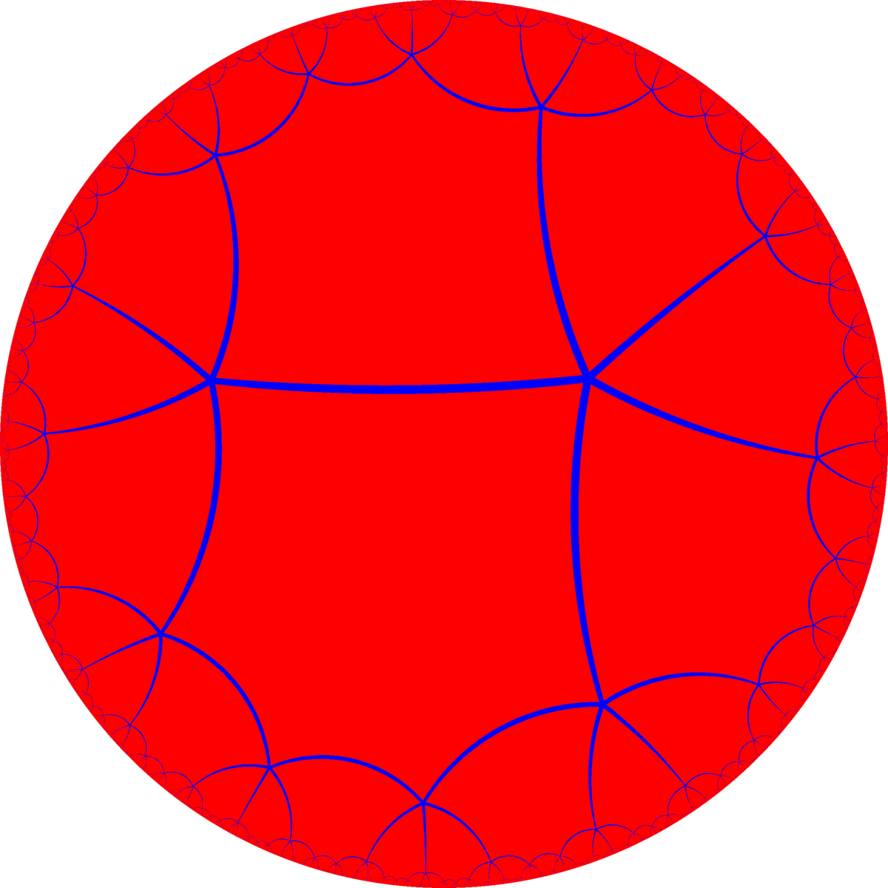
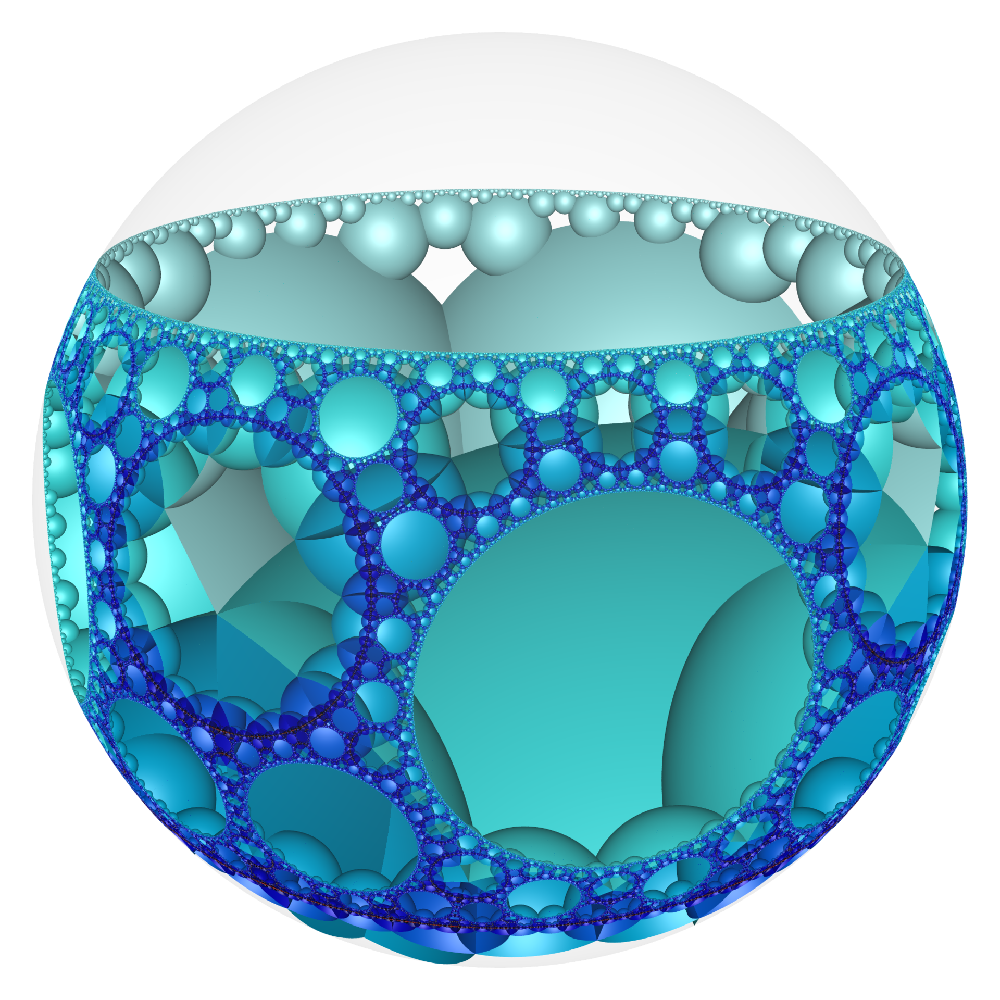

This post is a collection of symbols for myself. It's exactly as self-centered as it sounds.

## Pronounciation

Using [IPA](https://en.wikipedia.org/wiki/International_Phonetic_Alphabet) my name is pronounced: [rʉ́wpət məˈkaɪ](http://ipa-reader.xyz/?text=r%CA%89%CC%81wp%C9%99t%20m%C9%99%CB%88ka%C9%AA)

## Images

Here's a headshot of me. It was taken some time around 2018 or 2019.

And here's another which has been roughly cropped. I upload this as a custom emoji everywhere I can 😄

## Morse

The following glyph is a representation of "RM" using [Morse code](https://en.wikipedia.org/wiki/Morse_code). I use it in a couple places as a little visual break throughout this website.

<pre>
█ ███ █
███ ███
</pre>

The first row is the letter "R" and the second row is letter "M". Not all letters of the Morse alphabet are symmetric or of equal length, so it was especially lucky how "RM" lined up so neatly like this. I would have preferred to use "RFM" but the letter "F" is not symmetric, nor of equal length to the others. If I included the "F" then the "RFM" glyph would look like this.

<pre>
█ ███ █
█ █ ███ █
███ ███
</pre>

## Braille

I'm as fond of Braille as I am of Morse code, and yet I haven't found any way to render my name that look particularly interesting with it.

Here for example is "rfm":

⠗⠋⠍

Or "Rupert Foggo McKay":

⠠⠗⠥⠏⠑⠗⠞⠀⠠⠋⠕⠛⠛⠕⠀⠠⠍⠉⠠⠅⠁⠽

There's a nice little encoder for Braille at [cable.ayra.ch/braille](https://cable.ayra.ch/braille/). Or you might like to try learning braille yourself at [learn-braille](https://fildon.me/learn-braille).

## Schläfli Symbols

The numbers of letters in each part of my name are as follows:

- "Rupert" has length 6
- "Foggo" has length 5
- "McKay" has length 5

We can use these numbers in [Schläfli symbols](https://en.wikipedia.org/wiki/Schl%C3%A4fli_symbol) to generate various polytopes.

- `{6/5}` = `{6/1}` = `{6}` is just a hexagon 😄.

- `6{5}` is six interleaved pentagons, forming a [Compound polytope](https://en.wikipedia.org/wiki/List_of_regular_polytopes_and_compounds#Two_dimensional_compounds). It looks like this:

<svg xmlns="http://www.w3.org/2000/svg" version="1.1" height="200px" viewBox="0 0 1000 1000">
  <g style="stroke:#ff0000;stroke-width:5.0;stroke-opacity:1.00;fill-opacity:00">
  </g>
  <g style="stroke:#ff7f00;stroke-width:5.0;stroke-opacity:1.00;fill-opacity:00">
  <path d="M 954.545,497.261 640.462,64.963"/>
  <path d="M 640.462,64.963 132.265,230.086"/>
  <path d="M 132.265,230.086 132.265,764.436"/>
  <path d="M 640.462,929.559 132.265,764.436"/>
  <path d="M 954.545,497.261 640.462,929.559"/>
  </g>
  <g style="stroke:#ffff00;stroke-width:5.0;stroke-opacity:1.00;fill-opacity:00">
  <path d="M 547.513,45.206 944.613,402.756"/>
  <path d="M 547.513,45.206 84.752,312.381"/>
  <path d="M 84.752,312.381 195.85,835.054"/>
  <path d="M 727.273,890.909 195.85,835.054"/>
  <path d="M 944.613,402.756 727.273,890.909"/>
  </g>
  <g style="stroke:#00ff00;stroke-width:5.0;stroke-opacity:1.00;fill-opacity:00">
  <path d="M 452.487,45.206 915.248,312.381"/>
  <path d="M 452.487,45.206 55.387,402.756"/>
  <path d="M 55.387,402.756 272.727,890.909"/>
  <path d="M 272.727,890.909 804.15,835.054"/>
  <path d="M 915.248,312.381 804.15,835.054"/>
  </g>
  <g style="stroke:#00ffff;stroke-width:5.0;stroke-opacity:1.00;fill-opacity:00">
  <path d="M 359.538,64.963 867.735,230.086"/>
  <path d="M 45.455,497.261 359.538,64.963"/>
  <path d="M 45.455,497.261 359.538,929.559"/>
  <path d="M 359.538,929.559 867.735,764.436"/>
  <path d="M 867.735,764.436 867.735,230.086"/>
  </g>
  <g style="stroke:#0000ff;stroke-width:5.0;stroke-opacity:1.00;fill-opacity:00">
  <path d="M 272.727,103.613 804.15,159.468"/>
  <path d="M 55.387,591.766 272.727,103.613"/>
  <path d="M 452.487,949.316 55.387,591.766"/>
  <path d="M 452.487,949.316 915.248,682.141"/>
  <path d="M 915.248,682.141 804.15,159.468"/>
  </g>
  <g style="stroke:#7f00ff;stroke-width:5.0;stroke-opacity:1.00;fill-opacity:00">
  <path d="M 727.273,103.613 195.85,159.468"/>
  <path d="M 84.752,682.141 195.85,159.468"/>
  <path d="M 547.513,949.316 84.752,682.141"/>
  <path d="M 547.513,949.316 944.613,591.766"/>
  <path d="M 944.613,591.766 727.273,103.613"/>
  </g>
  <g style="stroke:#000000;stroke-width:0.6666667;fill:#000000">
  <circle cx="954.545" cy="497.261" r="8.0"/>
  <circle cx="640.462" cy="64.963" r="8.0"/>
  <circle cx="640.462" cy="64.963" r="8.0"/>
  <circle cx="132.265" cy="230.086" r="8.0"/>
  <circle cx="132.265" cy="230.086" r="8.0"/>
  <circle cx="132.265" cy="764.436" r="8.0"/>
  <circle cx="132.265" cy="764.436" r="8.0"/>
  <circle cx="640.462" cy="929.559" r="8.0"/>
  <circle cx="640.462" cy="929.559" r="8.0"/>
  <circle cx="954.545" cy="497.261" r="8.0"/>
  <circle cx="944.613" cy="402.756" r="8.0"/>
  <circle cx="547.513" cy="45.206" r="8.0"/>
  <circle cx="547.513" cy="45.206" r="8.0"/>
  <circle cx="84.752" cy="312.381" r="8.0"/>
  <circle cx="84.752" cy="312.381" r="8.0"/>
  <circle cx="195.85" cy="835.054" r="8.0"/>
  <circle cx="195.85" cy="835.054" r="8.0"/>
  <circle cx="727.273" cy="890.909" r="8.0"/>
  <circle cx="727.273" cy="890.909" r="8.0"/>
  <circle cx="944.613" cy="402.756" r="8.0"/>
  <circle cx="915.248" cy="312.381" r="8.0"/>
  <circle cx="452.487" cy="45.206" r="8.0"/>
  <circle cx="452.487" cy="45.206" r="8.0"/>
  <circle cx="55.387" cy="402.756" r="8.0"/>
  <circle cx="55.387" cy="402.756" r="8.0"/>
  <circle cx="272.727" cy="890.909" r="8.0"/>
  <circle cx="272.727" cy="890.909" r="8.0"/>
  <circle cx="804.15" cy="835.054" r="8.0"/>
  <circle cx="804.15" cy="835.054" r="8.0"/>
  <circle cx="915.248" cy="312.381" r="8.0"/>
  <circle cx="867.735" cy="230.086" r="8.0"/>
  <circle cx="359.538" cy="64.963" r="8.0"/>
  <circle cx="359.538" cy="64.963" r="8.0"/>
  <circle cx="45.455" cy="497.261" r="8.0"/>
  <circle cx="45.455" cy="497.261" r="8.0"/>
  <circle cx="359.538" cy="929.559" r="8.0"/>
  <circle cx="359.538" cy="929.559" r="8.0"/>
  <circle cx="867.735" cy="764.436" r="8.0"/>
  <circle cx="867.735" cy="764.436" r="8.0"/>
  <circle cx="867.735" cy="230.086" r="8.0"/>
  <circle cx="804.15" cy="159.468" r="8.0"/>
  <circle cx="272.727" cy="103.613" r="8.0"/>
  <circle cx="272.727" cy="103.613" r="8.0"/>
  <circle cx="55.387" cy="591.766" r="8.0"/>
  <circle cx="55.387" cy="591.766" r="8.0"/>
  <circle cx="452.487" cy="949.316" r="8.0"/>
  <circle cx="452.487" cy="949.316" r="8.0"/>
  <circle cx="915.248" cy="682.141" r="8.0"/>
  <circle cx="915.248" cy="682.141" r="8.0"/>
  <circle cx="804.15" cy="159.468" r="8.0"/>
  <circle cx="727.273" cy="103.613" r="8.0"/>
  <circle cx="195.85" cy="159.468" r="8.0"/>
  <circle cx="195.85" cy="159.468" r="8.0"/>
  <circle cx="84.752" cy="682.141" r="8.0"/>
  <circle cx="84.752" cy="682.141" r="8.0"/>
  <circle cx="547.513" cy="949.316" r="8.0"/>
  <circle cx="547.513" cy="949.316" r="8.0"/>
  <circle cx="944.613" cy="591.766" r="8.0"/>
  <circle cx="944.613" cy="591.766" r="8.0"/>
  <circle cx="727.273" cy="103.613" r="8.0"/>
  </g>
</svg>

- `{6,5}` is an infinite tiling of hexagons, with five arranged around each vertex. This is not possible in Euclidean 2D space, but is possible on a hyperbolic plane. [Order-5 Hexagonal Tiling](https://en.wikipedia.org/wiki/Order-5_hexagonal_tiling). It looks like this:

- `{6,5,5}` is hard to explain. By construction: take five copies of the previous polytope (`{6,5}`) and arrange them around a common point. But since the previous polytope was already an infinite tiling of a hyperbolic plane, the result for this one is a hyperbolic honeycomb. It looks like this:

